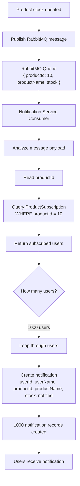

# Inventory

Monorepo-style layout:

| Folder      | Description                          |
|-------------|--------------------------------------|
| `backend/`  | Express + Prisma inventory API       |
| `frontend/` | React + Vite minimal UI              |

## Backend quick start

```bash
cd backend
npm install
cp .env.example .env
npx prisma migrate dev
npm run seed
npm run dev
```

## Frontend quick start

```bash
cd frontend
npm install
npm run dev
```

Open `http://localhost:5173` (backend must be running on port 3000).

See [`backend/README.md`](./backend/README.md) for API docs and [`backend/PROGRESS.md`](./backend/PROGRESS.md) for the implementation checklist (useful after session resets).

## Notification Service Flow

The notification flow starts when product stock is updated. The producer publishes a RabbitMQ message into the broker queue with the updated product details, such as product id, product name, and current stock information.

The notification service consumes the message from RabbitMQ, reads the `productId`, finds all users subscribed to that product, and creates one notification record for each user.

### Queue Message

Example RabbitMQ message:

```json
{
  "productId": 10,
  "productName": "Wireless Mouse",
  "stock": 5
}
```

### Consumer Analysis

The broker queue is consumed by the notification service. For every message, the service analyzes:

| Field | Description |
|-------|-------------|
| `productId` | Product that was newly updated |
| `productName` | Name of the updated product |
| `stock` | Latest stock value |
| `userId` | User who subscribed to the product |
| `userName` | Name of the subscribed user |
| `notified` | Whether notification creation or delivery is completed |

### Notification Processing Steps

1. Product stock is updated in the inventory system.
2. A RabbitMQ message is published with the updated product details.
3. Notification service consumes the message.
4. Service reads the `productId` from the message.
5. Service queries `ProductSubscription` to find users subscribed to that product.
6. If 1000 users are subscribed, the service loops through all 1000 users.
7. Service creates 1000 notification records, one notification per user.
8. Each notification can then be shown in the UI, sent by email, or processed by another delivery worker.

### SQL Lookup

```sql
SELECT userId
FROM ProductSubscription
WHERE productId = 10;
```

### Mermaid Diagram



### Example End-to-End Flow

```text
RabbitMQ Message

{
  "productId": 10
}

v

Notification Service

v

SELECT userId
FROM ProductSubscription
WHERE productId = 10

v

1000 Users

v

Loop

v

Create 1000 Notifications
```

### Expected Result

For one product update, the system does not create only one notification. It creates notifications based on the number of users subscribed to that product.

Example:

| Product | Subscribed Users | Notifications Created |
|---------|------------------|------------------------|
| Product 10 | 1 user | 1 notification |
| Product 10 | 100 users | 100 notifications |
| Product 10 | 1000 users | 1000 notifications |

This ensures every subscribed user receives their own notification status and the system can track whether each user has been notified.

